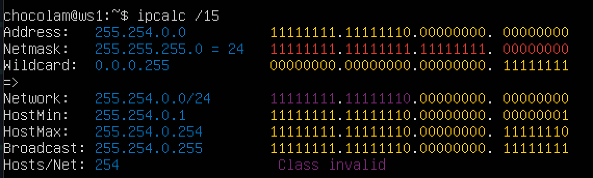
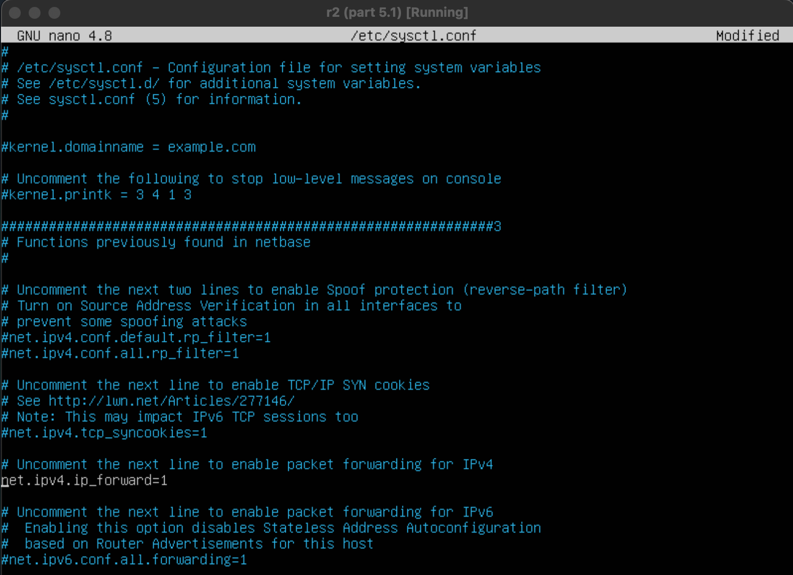
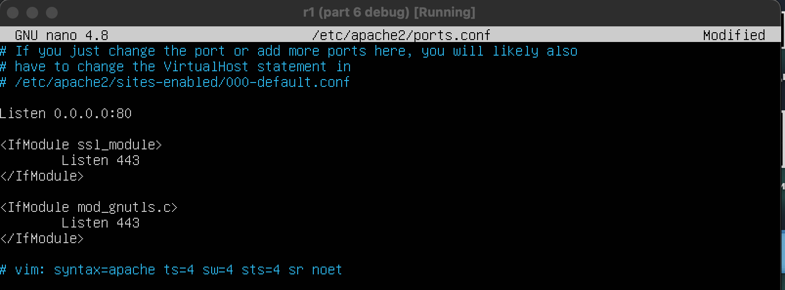

## Part 1. Инструмент ipcalc

#### Установила ipcalc:

### 1.1. Сети и маски

#### 1) Адрес сети 192.167.38.54/13 (`192.160.0.0`):

---

#### 2) Перевод маски:

- 255.255.255.0 в префиксную (`/24`) и двоичную (`11111111.11111111.11111111.00000000`) запись:

---

- /15 в обычную (`255.254.0.0`) и двоичную (`11111111.11111110.00000000.00000000`)

---

- 11111111.11111111.11111111.11110000 в обычную (`255.255.255.240`) и префиксную (`/28`)

---

#### 3) Минимальный и максимальный хост в сети 12.167.38.4 при масках:

- /8 min: `12.0.0.1`
- /8 max: `12.255.255.254`

---
- 11111111.11111111.00000000.00000000 min: `12.167.0.1`
- 11111111.11111111.00000000.00000000 max: `12.167.255.254`

---

- 255.255.254.0 min: `12.167.38.1`
- 255.255.254.0 max: `12.167.38.254`

---

- /4 min: `0.0.0.1`
- /4 max: `15.255.255.254`

---
---

### 1.2. localhost

#### Можно ли обратиться к приложению, работающему на localhost, со следующими IP:

- 194.34.23.100 - нельзя
- 127.0.0.2 - можно
- 127.1.0.1 - можно
- 128.0.0.1 - нельзя

`адреса должны находиться в диапазоне 127.0.0.1 — 127.255.255.254`

---
---

### 1.3. Диапазоны и сегменты сетей

#### 1) Какие из перечисленных IP можно использовать в качестве публичного, а какие только в качестве частных:

`Публичные IP-адреса: IP-адреса в диапазонах 1.0.0.0 - 9.255.255.255, 11.0.0.0 - 126.255.255.255, 128.0.0.0 - 169.253.255.255, 169.255.0.0 - 172.15.255.255, 172.32.0.0 - 191.241.255.255, 192.0.0.0 - 223.255.255.255`

- 134.43.0.2
- 172.0.2.1
- 192.172.0.1
- 172.68.0.2
- 192.169.168.1

`Частные IP-адреса: IP-адреса в диапазонах 10.0.0.0 - 10.255.255.255, 172.16.0.0 - 172.31.255.255, 192.168.0.0 - 192.168.255.255`

- 10.0.0.45
- 192.168.4.2
- 172.20.250.4
- 172.16.255.255
- 10.10.10.10
---

#### 2) Какие из перечисленных IP адресов шлюза возможны у сети 10.10.0.0/18:

- 10.0.0.1 - нет
- 10.10.0.2 - да
- 10.10.10.10 - да
- 10.10.100.1 - нет
- 10.10.1.255: - да

`Диапазон адресов для сети 10.10.0.0/18:`
- Начальный IP адрес: 10.10.0.1
- Конечный IP адрес: 10.10.63.254

---
---

## Part 2. Статическая маршрутизация между двумя машинами.

#### Подняла 2 виртуальные машины:

---

#### Настраиваем локальное соединение на обеих машинах через VirtualBox:

---

#### С помощью команды `ip a` посмотрела существующие сетевые интерфейсы:

`ws1:`

`ws2:`

---

#### Cодержание изменённого файла `etc/netplan/00-installer-config.yaml` для каждой машины + перезапуск сервиса сети с помощью команды `netplan apply`:

`ws1:`

`ws2:`

---

#### 2.1. Добавление статического маршрута вручную

Добавила статический маршрут от одной машины до другой и обратно при помощи команды вида `ip r add <address> dev enp0s8`, пропинговала соединение между машинами с помощью команды `ping <address>`:

`ws1:`

`ws2:`

---

#### 2.2. Добавление статического маршрута с сохранением

- Перезапустила машины с помощью `sudo reboot`;
- Добавила статический маршрут от одной машины до другой с помощью файла `etc/netplan/00-installer-config.yaml`;
- Cделала перезапуск сервиса сети c помощью команды `netplan apply`;
- Пропинговала соединение между машинами с помощью команды `ping <address>`:

`ws1:`

`ws2:`

---
---

## Part 3. Утилита iperf3

#### 3.1. Скорость соединения

- 8 Mbps - 1 MB/s
- 100 MB/s - 800000 Kbps
- 1 Gbps - 1000 Mbps

---

#### 3.2. Утилита iperf3

- Устанавливаем утилиту `sudo apt-get install iperf3`
- Измеряем скорость соединения между `ws1` и `ws2`

`ws1`

`ws2`

---
---

## Part 4. Сетевой экран

#### 4.1. Утилита iptables

- содержание файла `/etc/firewall.sh` для каждой машины:

`ws1:`

`ws2:`

- запуск обоих файлов;

`ws1:`

`ws2:`

- разница между стратегиями, применёнными в первом и втором файлах:

1. `iptabels` выполняет первое прочитанное правило, поэтому разница между стратегиями заключается в порядке команд
2. в `ws1` первой стоит команда `REJECT` - отклонить пакет, поэтому выполняется этот запрет и пинг не пройдет
3. в `ws2` первым стоит `ACCEPT` - разрешить прохождение пакета, поэтому пинг проходит

---

#### 4.2. Утилита nmap

- вызов и вывод использованных команд ping и nmap

`ws1 ping:`

`ws2 ping + nmap:`

---
---

## Part 5. Статическая маршрутизация сети

#### 5.1. Настройка адресов машин

- содержание файла `etc/netplan/00-installer-config.yaml` для каждой машины:

  
 

- командой `ip -4 a` проверяю, что адрес машины задан верно:

  
 

- пропинговала `ws22` с `ws21`:

- пропинговала `r1` с `ws11`:

---

#### 5.2. Включение переадресации IP-адресов

- Для включения переадресации IP, выполнила команду `sysctl -w net.ipv4.ip_forward=1` на роутерах:

`r1:`

`r2:`

- Открыла файл /etc/sysctl.conf и добавила в него следующую строку:
`net.ipv4.ip_forward = 1`:

`r1:`

`r2:`

---

#### 5.3. Установка маршрута по-умолчанию

- Настроила маршрут по-умолчанию (шлюз) для рабочих станций. Для этого добавила `default` перед IP роутера в файле конфигураций:

`ws11:`

`ws21:`

`ws22:`

- Вызвала `ip r` чтобы показать, что добавился маршрут в таблицу маршрутизации:

`ws11:`

`ws21:`

`ws22:`

- Пропинговала с `ws11` роутер `r2` с использованием команды `tcpdump -tn -i eth0`, пинг доходит:

1. `tcpdump -D` - чтобы посмотреть какие девайсы можно прослушать

2. Запускаем `tcpdump` на `r2`, она позволяет прослушать порты и вывести на экран информацию с каких IP адресов приходят пакеты (`tcpdump -tn -i enp0s8`)

3. Сначала на экране `r2` идёт ожидание входящих пакетов, в это время запускаем ping на `ws11`:

4. На экране должно `r2` появились 3 строки в которых видно, что пинг проходит:

---

#### 5.4. Добавление статических маршрутов

- Добавила в роутеры `r1` и `r2` статические маршруты в файле конфигураций:

`r1:`

`r2:`

- Вызвала `ip r` на обоих роутерах:

`r1:`

`r2:`

- Запустила команды `ip r list 10.10.0.0/[маска сети] и ip r list 0.0.0.0/0` на `ws11`:

- `ip r list 10.10.0.0/[маска сети]` показывает пути именно к сети `10.10.0.0/18`, а `ip r list 0.0.0.0/0` - к любой доступной сети с любой маской

---

#### 5.5. Построение списка маршрутизаторов

- выключила адаптер 2 на `ws1`, для установки утилиты на ws11 используем команду `sudo apt install traceroute`, потом снова подключаем 2 адаптер.

- Запустила на r1 команду дампа `tcpdump -tnv -i eth0`:

- При помощи утилиты traceroute построила список маршрутизаторов на пути от `ws11` до `ws21`:

Для того чтобы найти промежуточные маршрутизаторы до целевого узла, программа traceroute отправляет серию сообщений с увеличивающимся значением TTL (максимального числа переходов через маршрутизаторы). Каждый маршрутизатор на пути уменьшает TTL и, если его значение достигает нуля, отправляет обратно сообщение об ошибке. Процесс повторяется до тех пор, пока пакет не достигнет целевого узла, тем самым увеличивая значение ttl. При получении ответа от этого узла процесс трассировки считается завершённым. Traceroute записывает адрес каждого маршрутизатора и время задержки, чтобы можно было отследить путь до цели.

---

#### 5.6. Использование протокола ICMP при маршрутизации

- Запустила на `r1` перехват сетевого трафика, проходящего через `eth0` с помощью команды `tcpdump -n -i eth0 icmp`:

- Пропинговала с `ws11` несуществующий IP с помощью команды `ping -c 1 10.30.0.111`:

---
---

## Part 6. Динамическая настройка IP с помощью DHCP

- Для `r2` настроила в файле `/etc/dhcp/dhcpd.conf` конфигурацию службы DHCP:

1) Указала адрес маршрутизатора по-умолчанию, DNS-сервер и адрес внутренней сети

2) В файле `resolv.conf` прописала `nameserver 8.8.8.8`

- Перезагрузила службу DHCP командой `systemctl restart isc-dhcp-server`:

- Машину `ws21` перезагрузила при помощи `reboot` и через `ip a` видно, что она получила адрес:

- пропинговала `ws22` с `ws21`:

---

- Указала MAC адрес у `ws11` в `etc/netplan/00-installer-config.yaml`:

- Для `r1` настроила аналогично `r2`, но сделала выдачу адресов с жесткой привязкой к MAC-адресу (`ws11`):

- В файле `resolv.conf` прописала `nameserver 8.8.8.8`:

- Перезагрузила службу DHCP командой `systemctl restart isc-dhcp-server`:

- Проводим такие же тесты - смотрим какой адрес назначен машине `ws11`:

---

- Запросила с `ws21` обновление ip адреса:

1) "Убиваем" старый адрес `sudo dhclient -r enp0s8`, смотрим `ip a`:

2) Запрашиваем новый IP `sudo dhclient enp0s8`, смотрим `ip a`:

---
---

## Part 7. NAT

- В файле `/etc/apache2/ports.conf` на `ws22` и `r1` измени строку `Listen 80` на `Listen 0.0.0.0:80`, то есть сделай сервер `Apache2` общедоступным:

`r1:`

`ws22:`

- Запустила веб-сервер Apache командой `service apache2 start` на `ws22` и `r1`:

`r1:`

`ws22:`

---

- Добавь в фаервол, созданный по аналогии с фаерволом из Части 4, на r2 следующие правила:

1) Удаление правил в таблице `filter - iptables -F`;

2) Удаление правил в таблице "NAT" - `iptables -F -t nat`;

3) Отбрасывать все маршрутизируемые пакеты - i`ptables --policy FORWARD DROP`:

- Запустила файл, проверила соединение между `ws22` и `r1` командой ping:

---

- Добавила в файл ещё одно правило:

4) Разрешила маршрутизацию всех пакетов протокола ICMP:

- Запустила файл, проверила соединение между ws22 и r1 командой ping:

---

- Добавила в файл ещё два правила:

5) Включила SNAT, а именно маскирование всех локальных ip из локальной сети, находящейся за `r2`

6) Включила DNAT на 8080 порт машины `r2` и добавила к веб-серверу Apache, запущенному на `ws22`, доступ извне сети

- Запустила файл, проверила соединение по TCP для SNAT: для этого с `ws22` подключиться к серверу Apache на `r1` командой `telnet [адрес] [порт]`:

- Проверила соединение по TCP для DNAT: для этого с `r1` подключилась к серверу Apache на `ws22` командой `telnet` (обращалась по адресу r2 и порту 8080):

---
---

##

- Запустила на `r2` фаервол с правилами из Части 7:

- Запустила веб-сервер Apache на `ws22` только на localhost (то есть в файле `/etc/apache2/ports.conf` изменила строку `Listen 80` на `Listen localhost:80`):

- Воспользовалась Local TCP forwarding с `ws21` до `ws22`, чтобы получить доступ к веб-серверу на `ws22` с `ws21`:

 1) Использовала ssh-подключение с `ws21` к `ws22` с флагом `-L`, указывая сначала `localhost`, затем адрес `ws22`:

 

 2) c `ws21` подключилась к `ws22`:

  

 3) Запустила `telnet`:

 

- Воспользовалась Remote TCP forwarding c `ws11` до `ws22`, чтобы получить доступ к веб-серверу на `ws22` с `ws11`:

 1) Использовала ssh-подключение с `ws11` к `ws22` с флагом `-L`, указывая сначала `localhost`, затем адрес `ws22`:

 

 2) c `ws11` подключилась к `ws22`:

  

- Для проверки, сработало ли подключение в обоих предыдущих пунктах, перешла во второй терминал и выполнила команду `telnet 127.0.0.1 [локальный порт]`:

